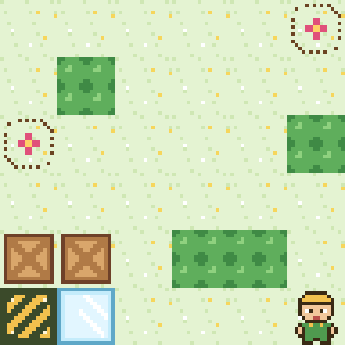

# El Muro que se Cierra

Un puzzle de cajas en un jardín muy raro: los setos te persiguen. Cada vez que das un paso, todos los setos de tu fila y
de tu columna avanzan una casilla hacia ti. Con dos novedades: la topadora, que empuja cajas, y el cristal, que huye.
Niveles propios, cada uno con su mínimo demostrado con las reglas del propio juego. Juego web autónomo en **PuzzleScript Next**.

## Cómo se juega
- **Objetivo:** llevar cada caja a una diana (las de la florecilla).
- **Flechas:** moverse; si hay una caja delante y detrás tiene sitio, la empujas (solo una). En el móvil, desliza el dedo. **Z:** deshacer · **R:** reiniciar.
- **Los setos se cierran:** tras cada paso (también al chocar), todos los setos de tu fila y de tu columna avanzan una casilla hacia ti; se paran al chocar y no empujan las cajas.
- **Topadora** (novedad de esta versión): se acerca como un seto y empuja la caja que tenga delante.
- **Cristal** (novedad de esta versión): hace lo contrario, se aleja una casilla cuando estás en su fila o en su columna.
- **Ayudas** (arriba a la derecha): ver las dianas tapadas, reiniciar, pista, deshacer y solución animada.

## Niveles
1. Me siguen: mínimo 7 pasos
2. Pared con pared: mínimo 11 pasos
3. Arrimados: mínimo 15 pasos
4. El pasillo: mínimo 18 pasos
5. Encerrona: mínimo 19 pasos
6. Cerrojo: mínimo 19 pasos
7. Dos cajas: mínimo 21 pasos
8. La topadora: mínimo 10 pasos
9. Obras: mínimo 13 pasos
10. Dos topadoras: mínimo 17 pasos
11. Empujón: mínimo 18 pasos
12. Hora punta: mínimo 20 pasos
13. Cristal: mínimo 12 pasos
14. Huida: mínimo 15 pasos
15. Espejito: mínimo 20 pasos
16. Todos a una: mínimo 31 pasos

## Créditos
- Niveles, topadora, cristal, arte 16-bit y tarjetas: **Spider** (Fali + Claude), 2026
- Juego original: *Collapsable Sokoban*, de **Franklin P. Dyer** (galería de PuzzleScript)
- Motor: [PuzzleScript Next](https://github.com/david-pfx/PuzzleScriptNext), incrustado en un único `index.html`
- Fuente del juego: [`juego.txt`](juego.txt)
